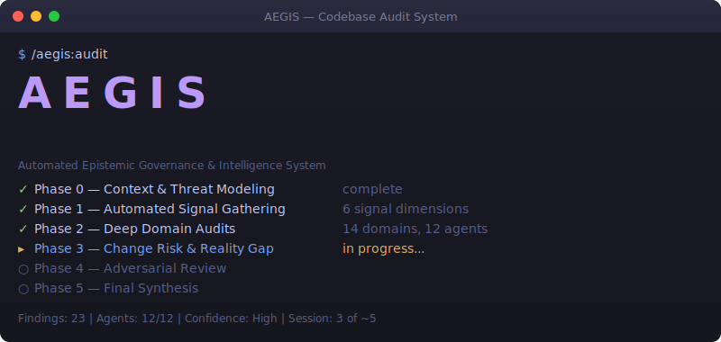

# AEGIS

**Automated Epistemic Governance & Intelligence System**

<p align="center">
  
</p>

A multi-session, multi-agent codebase audit system built on [Claude Code](https://claude.ai/code). AEGIS deploys 12 senior engineering personas across 14 audit domains to produce epistemically rigorous, adversarially reviewed findings on any codebase.

---

## Quick Install

```bash
curl -sSL https://raw.githubusercontent.com/ChristopherKahler/aegis/main/install.sh | bash
```

Then run `/aegis:audit` in Claude Code.

> **Requires:** [Claude Code](https://claude.ai/code) installed (`~/.claude/` directory must exist)

---

## Contents

- [Identity](#identity)
- [What AEGIS Is](#what-aegis-is)
- [Core Philosophy](#core-philosophy)
- [The 14 Audit Domains](#the-14-audit-domains)
- [The Agent Team](#the-agent-team)
- [Execution Phases](#execution-phases)
- [The Three Output Layers](#the-three-output-layers)
- [AEGIS Transform](#aegis-transform)
- [Intervention Levels](#intervention-levels)
- [The Transformation Model](#the-transformation-model)
- [Transform Agent Team](#transform-agent-team)
- [Transform Execution Phases](#transform-execution-phases)
- [Commands](#commands)
- [Change Risk in Remediation](#change-risk-in-remediation)
- [Safety & Liability Framework](#safety--liability-framework)
- [PAUL Integration](#paul-integration)
- [Pattern Corpus & Feedback Loop](#pattern-corpus--feedback-loop)
- [The Formal Epistemic Schema](#the-formal-epistemic-schema)
- [Disagreement Resolution System](#disagreement-resolution-system)
- [Disagreement Visualization Model](#disagreement-visualization-model)
- [Reality Gap Framework](#reality-gap-framework)
- [Language-Specific Failure Models](#language-specific-failure-models)
- [Tooling Stack](#tooling-stack)
- [Output Format](#output-format)
- [Signal Categories](#signal-categories)
- [Installation & Runtime](#v02--installation--runtime)
- [Ecosystem](#ecosystem)

---

## Ecosystem

AEGIS is part of a broader Claude Code extension ecosystem:

| System | What It Does | Link |
|--------|-------------|------|
| **AEGIS** | Multi-agent codebase auditing — diagnosis + controlled evolution | You are here |
| **BASE** | Builder's Automated State Engine — workspace lifecycle, health tracking, drift prevention | [GitHub](https://github.com/ChristopherKahler/base) |
| **CARL** | Context Augmentation & Reinforcement Layer — dynamic rules loaded JIT by intent | [GitHub](https://github.com/ChristopherKahler/carl) |
| **PAUL** | Project orchestration — Plan, Apply, Unify Loop | [GitHub](https://github.com/ChristopherKahler/paul) |
| **SEED** | Typed project incubator — guided ideation through graduation into buildable projects | [GitHub](https://github.com/ChristopherKahler/seed) |
| **Skillsmith** | Skill builder — standardized syntax specs + guided workflows for Claude Code skills | [GitHub](https://github.com/ChristopherKahler/skillsmith) |
| **CC Strategic AI** | Skool community — courses, community, live support | [Skool](https://chrisai.cv/skool) |

---

## Identity

**AEGIS** (/ee-jis/) — In Greek mythology, the aegis was the divine shield carried by Zeus and Athena. It represented protection under authority — not passive defense, but the active, authoritative safeguarding of what matters.

AEGIS is that shield for codebases.

The name encodes what the system actually does:

- **Automated** — Multi-agent, multi-phase, tool-augmented analysis requiring no manual orchestration
- **Epistemic** — Built on a formal schema for how knowledge is structured, challenged, and trusted under uncertainty
- **Governance** — Compliance, oversight, and the Principal Engineer's role as epistemic governor of the entire audit
- **Intelligence** — AI-powered domain expert agents producing findings no single human could match in breadth
- **System** — Not a tool, not a script. A coordinated system of systems with defined phases, roles, and accountability

---

## What AEGIS Is

AEGIS is a **multi-session, multi-agent codebase audit system** built on Claude Code. It deploys a team of senior engineering personas — each an expert in a specific domain — to conduct a comprehensive analysis of any application codebase.

It is not a linter. It is not a static analyzer. It is not a report generator.

It is **an AI Principal Engineer** — a machine that performs disciplined doubt.

AEGIS answers five fundamental questions that senior engineers ask when they walk into an unknown codebase:

1. Can this system be **trusted**?
2. Can it survive **change**?
3. Can it **scale**?
4. Can it be **operated safely**?
5. Can new engineers **understand** it?

Every audit produces findings across all domains, uses structured epistemic reasoning, cross-validates through adversarial review, and synthesizes into actionable, severity-ranked reports.

---

## Core Philosophy

> Senior engineers don't just find bugs — they find **future failures**.

Three principles distinguish AEGIS from conventional code analysis:

1. **Disciplined Doubt Over Coherent Confidence** — Most AI systems optimize for helpfulness and clean narratives. AEGIS optimizes for correctness under uncertainty, asymmetric risk detection, and institutional memory of failure patterns.

2. **The Principal Builds the Story. The Devil's Advocate Breaks It. Truth Lives in the Tension.** — No finding survives without challenge. No conclusion is trusted without adversarial review. Disagreement is signal, not noise.

3. **Evidence > Assumptions > Code > Documentation** — The epistemic schema enforces a strict separation between observations, interpretations, and judgments. No shortcuts. No opinion soup.

---

## The 14 Audit Domains

AEGIS audits across 14 domains (0-13). Every audit produces findings in each domain — even if the finding is "no major issues found." Nothing is optional.

### Domain 0 — Context & Intent

**Must come first. Without this, every other audit is partially blind.**

| Aspect | Details |
|---|---|
| Owner | Principal Engineer |
| Purpose | Establish what the system does, who uses it, what constraints exist |

What to audit:
- What problem is this system solving?
- Who are the users?
- What are success/failure criteria?
- What data does it handle?
- What are its failure modes?
- What is the business criticality?
- What constraints exist (regulatory, cost, latency, team size)?
- What is explicitly OUT of scope?

### Domain 1 — Architecture & System Design

| Aspect | Details |
|---|---|
| Owner | Architect Agent |
| Why it matters | Architecture determines how easy bugs are to introduce, how expensive changes are, and whether scale is possible without rewrites |

What to audit:
- System boundaries and module responsibilities
- Dependency direction and layering consistency
- Coupling vs cohesion
- Domain modeling quality
- Data flow clarity
- Presence of clear architectural pattern (hexagonal, layered, microservices, etc.)
- Boundary enforcement vs violation
- "God modules" or "utility dumping grounds"
- Domain logic mixed with infrastructure

Key questions:
- Is there a clear architectural pattern?
- Are boundaries enforced or violated?
- Are "god modules" present?
- Is domain logic mixed with infrastructure?

### Domain 2 — Data & State Integrity

| Aspect | Details |
|---|---|
| Owner | Data Engineer Agent |
| Why it matters | Most catastrophic failures are data bugs, not code bugs — corrupt state, irreversible migrations, silent data loss, inconsistent derived data |

What to audit:
- Data models and schemas
- Schema evolution and migrations
- Backward compatibility
- Referential integrity
- Eventual consistency guarantees
- State transitions and invariants
- Data loss risks

### Domain 3 — Correctness & Logic

| Aspect | Details |
|---|---|
| Owner | Senior Application Engineer Agent |
| Why it matters | Most production incidents are boring logic bugs, not exotic failures |

What to audit:
- Logic errors and edge case handling
- Error propagation (swallowed, ignored, or properly handled)
- Concurrency correctness
- Input validation
- Data consistency
- Assumption documentation (documented or implicit)
- Invariant enforcement
- Retry safety (idempotency)

### Domain 4 — Security

| Aspect | Details |
|---|---|
| Owner | Security Engineer Agent |
| Why it matters | Security failures are existential risks |

What to audit:
- Authentication and authorization (AuthN/AuthZ)
- Secrets handling
- Input sanitization
- Injection risks (SQL, XSS, command, etc.)
- Dependency vulnerabilities
- Cryptography misuse
- Supply chain risk
- Trust boundaries
- Least-privilege enforcement
- Sensitive data in logs

### Domain 5 — Compliance Privacy & Governance

| Aspect | Details |
|---|---|
| Owner | Compliance Officer Agent |
| Why it matters | Compliance failures lead to fines, lawsuits, and shutdowns |

What to audit:
- PII handling and data classification
- Data retention policies
- Encryption at rest and in transit
- Audit logging
- Consent tracking
- Where personal data is stored
- How personal data is deleted
- Whether access is auditable

### Domain 6 — Testing Strategy & Verification

| Aspect | Details |
|---|---|
| Owner | Test Engineer Agent |
| Why it matters | Senior engineers don't ask "Do you have tests?" — they ask "Would these tests catch the most expensive failures?" |

What to audit:
- Test pyramid shape (unit vs integration vs e2e balance)
- Determinism vs flakiness
- What ISN'T tested (gaps)
- Mutation resistance
- Contract testing presence
- Tests as documentation
- Failure coverage (do tests cover failure paths, not just happy paths?)

### Domain 7 — Reliability & Resilience

| Aspect | Details |
|---|---|
| Owner | SRE Agent |
| Why it matters | Production systems fail constantly — good ones degrade gracefully |

What to audit:
- Failure handling patterns
- Retry strategies (bounded? with backoff?)
- Timeouts
- Circuit breakers
- Startup/shutdown safety
- What happens when dependencies fail
- Whether failures are noisy or silent
- State recoverability

### Domain 8 — Scalability & Performance

| Aspect | Details |
|---|---|
| Owner | Performance Engineer Agent |
| Why it matters | Scaling failures are often design bugs, not hardware limits |

What to audit:
- Algorithmic complexity
- N+1 queries
- Caching strategy
- Resource usage patterns
- Async vs blocking behavior
- What grows with user count
- What grows with data size
- Where bottlenecks exist
- Whether backpressure is implemented

### Domain 9 — Maintainability & Code Health

| Aspect | Details |
|---|---|
| Owner | Senior Application Engineer Agent |
| Why it matters | Maintenance cost dominates total lifecycle cost |

What to audit:
- Code smells and duplication
- Naming clarity
- Documentation accuracy
- Whether intent is obvious
- Whether tests are meaningful or superficial
- Tech debt interest accruing

### Domain 10 — Operability & Developer Experience

| Aspect | Details |
|---|---|
| Owner | SRE Agent |
| Why it matters | Many "great codebases" fail in production because ops was ignored |

What to audit:
- CI/CD pipelines
- Rollback safety
- Feature flags
- Observability (logging, metrics, tracing)
- Ownership clarity
- Debuggability
- Local dev friction
- Can this be safely deployed on Friday?
- Can incidents be diagnosed quickly?
- Who owns what?

### Domain 11 — Change Risk & Evolvability

| Aspect | Details |
|---|---|
| Owner | Staff Engineer Agent |
| Why it matters | "How dangerous is it to touch this code?" predicts velocity decay, team burnout, and rewrite pressure |

What to audit:
- Change amplification (how many files does one change touch?)
- Refactor safety
- Blast radius analysis
- Modularity health
- How risky future changes are

### Domain 12 — Team Ownership & Knowledge Risk

| Aspect | Details |
|---|---|
| Owner | Staff Engineer Agent |
| Why it matters | Systems fail socially before they fail technically |

What to audit:
- Code authorship concentration
- Bus factor per module
- Tribal knowledge hotspots
- Documentation debt
- Review culture artifacts
- Knowledge silos

### Domain 13 — Risk Synthesis & Forecasting

| Aspect | Details |
|---|---|
| Owner | Principal Engineer Agent |
| Why it matters | Senior engineers think in predictions: "This will break in 3 months," "This will fail at 10x traffic," "This is safe unless compliance changes" |

What to synthesize:
- Likelihood x impact for all findings
- Time-to-failure predictions
- "What breaks first" analysis
- Risk acceptance vs remediation recommendations
- Cross-domain emergent risks

---

## The Agent Team

AEGIS deploys a minimal-complete set of agent personas. Each exists because removing it would leave a blind spot. No overlap, no bloat.

### 1. Principal Engineer

**Role:** Epistemic governor of the entire audit

The Principal Engineer is NOT the best coder, architect, or the most knowledgeable in every domain. They are the person accountable for the **correctness of collective reasoning**.

**Core mental models:**
- Thinks in systems of systems — "What behavior emerges from these interactions?"
- Separates facts, interpretations, and judgments (enforces the epistemic schema)
- Actively manages uncertainty — budgets it rather than eliminating it
- Thinks in time horizons (immediate, near-term, long-term, hypothetical)
- Optimizes organizational attention, not code

**Responsibilities:**
1. Define audit scope and non-goals (Phase 0)
2. Calibrate severity scales
3. Resolve cross-domain conflicts
4. Synthesize narrative
5. Forecast future failure
6. Translate findings for multiple audiences
7. Own the final call
8. Explicitly respond to every Devil's Advocate critique

**Must never:**
- Introduce new raw findings late
- Re-run tools
- Argue minutiae

They reason, arbitrate, and narrate.

**Active in:** Phase 0 (Context), Phase 5 (Synthesis)

### 2. Architect

**Domains:** 1 (Architecture & System Design)

Evaluates structural patterns, boundaries, dependency direction, coupling, cohesion, and whether the architecture can support the system's actual requirements.

### 3. Data Engineer

**Domains:** 2 (Data & State Integrity)

Evaluates data models, schema evolution, migrations, referential integrity, consistency guarantees, and state transition safety.

### 4. Security Engineer

**Domains:** 4 (Security)

Evaluates AuthN/AuthZ, secrets handling, injection risks, supply chain, cryptography, trust boundaries, and attacker models.

### 5. Compliance Officer

**Domains:** 5 (Compliance Privacy & Governance)

Evaluates PII handling, data retention, encryption, audit logging, consent tracking, and regulatory exposure.

### 6. Senior Application Engineer

**Domains:** 3 (Correctness & Logic), 9 (Maintainability & Code Health)

Evaluates logic correctness, error handling, edge cases, idempotency, code smells, naming, duplication, and intent clarity.

### 7. SRE (Site Reliability Engineer)

**Domains:** 7 (Reliability & Resilience), 10 (Operability & DevEx)

Evaluates failure handling, retries, timeouts, circuit breakers, CI/CD, rollback safety, observability, and operational readiness.

### 8. Performance Engineer

**Domains:** 8 (Scalability & Performance)

Evaluates algorithmic complexity, N+1 queries, caching, resource usage, async behavior, bottlenecks, and backpressure.

### 9. Test Engineer

**Domains:** 6 (Testing Strategy & Verification)

Evaluates test pyramid, determinism, mutation resistance, contract tests, failure coverage, and test-as-documentation quality.

### 10. Staff Engineer

**Domains:** 11 (Change Risk & Evolvability), 12 (Team Ownership & Knowledge Risk)

Evaluates change amplification, refactor safety, blast radius, bus factor, knowledge silos, and documentation debt. This is a synthesis-heavy role that draws on git history and social signals.

### 11. Reality Gap Analyst

**Purpose:** Detect divergence between "code as written" and "system as run"

This agent often finds: "The audit is technically correct but operationally wrong." Audits config files, environment-specific behavior, feature flags, deployment manifests, runtime overrides, and kill switches.

See [Reality Gap Framework](#reality-gap-framework) for full details.

### 12. Devil's Advocate Reviewer

**Purpose:** Hunt collective blind spots

The Devil's Advocate is NOT a contrarian, NOT "the negative one," NOT "the security pessimist." They are the agent that hunts collective blind spots.

**Why this role exists:**
Every audit naturally develops consensus gravity, optimism bias, tool bias ("the scanner didn't find anything"), and authority bias. The Devil's Advocate exists to break coherence.

**Core mental models:**
- Assume the model is wrong: "If this report is wrong, *how* would it be wrong?"
- Attack confidence, not just conclusions — target high-confidence claims, clean narratives, and areas with little disagreement
- Seek asymmetric failure: "What failure would be disproportionately damaging relative to how little we're talking about it?"
- Use inversion relentlessly: "Under what conditions does this become unsafe?"
- Do NOT propose solutions — solutions dilute the critique

**Outputs:**
1. Most confident claim I distrust
2. Least discussed but highest-impact risk
3. Assumptions that must hold for conclusions to be true
4. Evidence that was overweighted
5. Evidence that was ignored or unavailable
6. Alternate narrative that fits the data

**Critical rule:** If the Devil's Advocate panel is empty, the system is broken.

---

## Execution Phases

AEGIS Core executes in six diagnostic phases (0-5). Order matters. Phases 6-8 (the Transform pipeline) extend diagnosis into remediation — see [Transform Execution Phases](#transform-execution-phases).

### Phase 0 — Context & Threat Modeling

**Agent:** Principal Engineer

Establish intent, constraints, risk profile, and non-goals. Without this phase, all audits are shallow.

Inputs: Repository, documentation, README, deployment configs, any available business context.

Outputs: Audit scope document, threat model, risk profile, explicit non-goals.

### Phase 1 — Automated Signal Gathering

**Agents:** Tool runners (non-reasoning heavy)

Run automated tools. Gather signals across six orthogonal dimensions. No opinions yet. Just evidence.

**Signal dimensions:**
1. **Structure** — SonarQube, Semgrep, dependency graphs
2. **Behavior** — Profilers, async analysis
3. **History** — Git churn, file age vs modification frequency, author concentration
4. **Dependencies** — Trivy, Syft, Grype, OpenSSF Scorecard
5. **Policy posture** — Checkov, Gitleaks, Semgrep
6. **Runtime contracts** — OpenAPI/gRPC schema validation, backward compatibility

Outputs: Normalized signal data tagged with severity, confidence, blast radius, and domain relevance.

### Phase 2 — Deep Domain Audits

**Agents:** Architect, Data Engineer, Security Engineer, Compliance Officer, Senior Application Engineer, SRE, Performance Engineer, Test Engineer

Each agent audits ONLY their assigned domains. Each receives the same Phase 1 evidence. Each produces independent findings using the formal epistemic schema.

Sessions can run in parallel. Each produces a structured findings file.

### Phase 3 — Change Risk, Team Risk & Reality Gap

**Agents:** Staff Engineer, Reality Gap Analyst

Synthesis-heavy roles that draw on Phase 2 findings + git history + configuration analysis.

The Staff Engineer evaluates change risk and ownership risk.
The Reality Gap Analyst checks for divergence between code-as-written and system-as-run.

### Phase 4 — Adversarial Review ("Fresh Eyes")

**Agent:** Devil's Advocate Reviewer

Goal: Invalidate conclusions, not agree. A fresh session whose only job is to challenge assumptions, attack confidence, and surface what was missed.

The Devil's Advocate reads ALL domain findings and produces their critique.

### Phase 5 — Synthesis & Report Generation

**Agent:** Principal Engineer

The Principal reads all domain findings + Devil's Advocate critique. For every disagreement, they must explicitly respond. Silence is not allowed.

Produces the final AEGIS report:
1. Executive Risk Summary
2. Architecture Narrative
3. Findings by Domain (severity-ranked)
4. Cross-Validation Notes (disagreements and resolutions)
5. Remediation Roadmap
6. Long-Term Structural Risks
7. "What Would Break First at 10x Scale"

---

## The Three Output Layers

AEGIS produces three distinct output layers. Each has a different purpose, different mutability, and different consumer.

**Layer A — Diagnostic Artifact (Truth Layer)**

The audit itself. Immutable, reproducible, epistemically versioned. Phases 0-5 produce Layer A. It is the forensic record of what was found, how it was found, and how confident the system is.

Layer A is never mutated. Once a finding is produced, it exists permanently in the audit record. Subsequent analysis may reinterpret it, but the original observation stands.

**Layer B — Remediation Knowledge (Instruction Layer)**

Derived from Layer A. Framework-specific. Pattern-based. Educational. This is where playbooks live.

Layer B answers: "Given what was found, how should it be fixed?" But not generically — parametrically. Every remediation is expressed at four layers of specificity (see [The Transformation Model](#the-transformation-model)) and carries both human-readable markdown and machine-consumable structured data.

Layer B is derived. It cannot exist without Layer A. It cannot contradict Layer A. If a finding changes, Layer B artifacts that reference it must be regenerated.

**Layer C — Change Orchestration (Execution Layer)**

Dependency-aware execution plans. Change graphs. Risk scoring. Verification gates. This is operational sequencing, not documentation.

Layer C answers: "In what order should fixes be applied, with what safety checks, and what happens if something goes wrong?"

Layer C is the PAUL integration point. AEGIS Transform produces PAUL-ready project artifacts — phased remediation plans with dependency ordering, risk-scored task definitions, and verification gates. AEGIS does not execute changes. PAUL does.

**The Pipeline:**

```
Layer A (Diagnosis) → Layer B (Knowledge) → Layer C (Orchestration)
  Immutable truth      Derived instruction     Operational planning
  Phases 0-5           Phases 6-7              Phase 8
```

---

## AEGIS Transform

**The Controlled Evolution Engine**

AEGIS Core is a diagnosis system. It finds problems with epistemic rigor and forensic-grade traceability. But diagnosis alone is incomplete. A report that says "you have 47 findings" without actionable, risk-scored, dependency-ordered remediation is a paper tiger.

AEGIS Transform is the second-order reasoning system that converts diagnostic findings into AI-consumable transformation artifacts — playbooks, remediation plans, guardrails, and PAUL-integrated execution plans.

**Core Principle:** *Diagnosis is decentralized. Intervention is centralized.*

In the diagnostic pipeline, 12 agents work independently across 14 domains. Each agent audits its own territory. Independence prevents groupthink.

In the Transform pipeline, 5 agents coordinate intervention. Remediation cannot be done in isolation — a fix to the authentication system affects security, architecture, testing, and deployment. Transform agents see the full picture and orchestrate change holistically.

**What Transform Is Not:**

- It is not bolt-on post-processing. It is a second-order reasoning system with its own agents, workflows, and risk modeling.
- It is not auto-remediation. Transform proposes changes; humans (via PAUL) execute them.
- It is not generic advice. Transform produces parametric, framework-specific, project-contextualized remediation.

**What Transform Consumes:**

All Layer A outputs — findings, domain knowledge, confidence scores, disagreements, cross-validation notes. Transform agents have full visibility into the diagnostic record.

**What Transform Produces:**

- Layer B: Remediation knowledge (playbooks, patterns, guardrails, educational context)
- Layer C: Change orchestration (dependency graphs, risk scores, verification plans, PAUL projects)

---

## Intervention Levels

Every Transform output is explicitly classified by intervention level. This is not optional. Intervention levels gate what the system is allowed to produce and how much confidence is required.

| Level | Name | Definition | Confidence Required |
|-------|------|------------|---------------------|
| 1 | **Suggesting** | "Consider this pattern." Informational. No action implied. | Any |
| 2 | **Planning** | "Here's how to fix this." Structured plan. Human decides whether to act. | Medium+ |
| 3 | **Authorizing** | "This change is recommended with confidence X." Risk-scored, gate-checked. | High |
| 4 | **Executing** | "Apply this change." Only via PAUL with verification gates. Never auto-applied by AEGIS. | High + Low change risk |

**Safety Principle:** *Default to the lowest intervention level that serves the user. Escalation requires evidence.*

A finding with medium confidence gets Suggesting or Planning. Never Authorizing. A change with high blast radius stays at Planning even with high confidence. Intervention levels are a ratchet — evidence raises them, uncertainty lowers them.

**Why This Matters:**

Without explicit intervention levels, every AI code tool produces the same thing: confident-sounding suggestions with no accountability framework. AEGIS Transform distinguishes between "you might want to look at this" and "we are confident this change should be made, here is the risk assessment, and here is how to verify it worked."

---

## The Transformation Model

Remediation knowledge is parametric, not generic. Generic advice ("use parameterized queries") is useless to a developer staring at a specific codebase. The 4-layer transformation model ensures every piece of remediation is grounded at every level of specificity.

### Layer 1 — Abstract Pattern

The universal principle. Language-agnostic. Framework-agnostic.

*Example:* "Unbounded retries are dangerous. They amplify load during partial outages and can cause cascading failures."

### Layer 2 — Framework Mapping

The principle applied to a specific framework.

*Example:* "In Laravel, use `retryUntil()` with a deadline. In Express, use the `p-retry` library with exponential backoff. In Spring Boot, use `@Retryable` with `maxAttempts` and `backoff`."

### Layer 3 — Language Mapping

The implementation pattern in the project's language.

*Example:* "PHP retry with exponential backoff: `$delay = min($baseDelay * (2 ** $attempt), $maxDelay)`"

### Layer 4 — Project Context

The specific files, functions, and call sites in this codebase.

*Example:* "Files `app/Services/PaymentGateway.php` (line 47), `app/Jobs/SyncInventory.php` (line 112), and `app/Http/Controllers/WebhookController.php` (line 89) — these 3 call sites use unbounded `retry()` loops. Each needs exponential backoff with a circuit breaker."

### Why Generic Remediation Is Fluff

A playbook that only contains Layer 1 is an essay. A playbook that contains all four layers is a work order. The difference between "you should fix your retries" and "here are the 3 files, here is the pattern for your framework, and here is how to verify it works" is the difference between a blog post and engineering guidance.

---

## Transform Agent Team

Transform deploys 5 specialized agents. Each exists because removing it would leave a gap in the remediation pipeline.

**Design Principle:** *Remediation must be centralized. Domain agents diagnose independently. Transform agents coordinate intervention.*

### Remediation Architect

**Role:** Translates diagnosis into structured change plans.

**Consumes:** All findings + domain knowledge + framework context.
**Produces:** Remediation playbooks at all 4 transformation layers. Change dependency graphs. Sequenced fix orders.

**Why they exist:** Someone has to synthesize 47 findings into "fix these 5 things in this order and the other 42 findings improve as side effects." The Remediation Architect identifies root causes, groups related findings, and sequences changes by dependency and impact.

### Change Risk Modeler

**Role:** Scores blast radius, coupling, regression probability, and architectural tension for every proposed change.

**Consumes:** Change plan + codebase structure + git history + test coverage.
**Produces:** Per-change risk scores. Risk-adjusted priority ordering. Change risk assessment reports.

**Why they exist:** Every fix introduces new risk. A change that fixes a security vulnerability but breaks 14 integration tests is not a net improvement. The Change Risk Modeler ensures that remediation doesn't create more problems than it solves.

### Pedagogy Agent

**Role:** Explains fixes for AI-assisted developers.

**Consumes:** Remediation plan + framework context + project patterns.
**Produces:** Educational context at all 4 transformation layers. Before/after examples. "Why this matters" explanations. Best-practice rationale.

**Why they exist:** The fastest-growing segment of developers uses AI assistants for code generation. They can implement a fix but may not understand *why*. Without pedagogical context, fixes get applied without understanding, and the same patterns recur. The Pedagogy Agent ensures that every fix teaches something.

### Guardrail Generator

**Role:** Writes project rules for future AI usage.

**Consumes:** Patterns + findings + project conventions.
**Produces:** `.claude/CLAUDE.md` rules. `.cursorrules` files. Linter configurations. Pre-commit hooks. Custom Semgrep rules.

**Why they exist:** The highest-leverage output of an audit isn't a report — it's a set of rules that prevent the same problems from recurring. The Guardrail Generator translates audit findings into machine-enforceable constraints.

### Execution Validator

**Role:** Defines verification plans — how to prove fixes work.

**Consumes:** Change plan + test infrastructure + deployment configuration.
**Produces:** Per-change verification steps. Expected outcomes. Rollback criteria. Test specifications.

**Why they exist:** A fix without a verification plan is faith-based engineering. The Execution Validator ensures that every change can be proven correct before it's considered complete.

---

## Transform Execution Phases

AEGIS Transform executes in three phases (6-8), extending the Core diagnostic pipeline (0-5).

### Phase 6 — Remediation Synthesis

**Agents:** Remediation Architect, Pedagogy Agent

**Input:** Complete Layer A diagnostic record (all findings, domain knowledge, disagreement resolutions, confidence scores).

**Process:**
1. Remediation Architect groups findings by root cause and dependency
2. Remediation Architect produces playbooks at all 4 transformation layers
3. Pedagogy Agent enriches playbooks with educational context, before/after examples, and best-practice rationale
4. Each playbook is classified by intervention level

**Output:** Layer B remediation playbooks (human-readable markdown + machine-consumable YAML). Pattern library updates.

### Phase 7 — Change Risk Validation

**Agents:** Change Risk Modeler, Guardrail Generator

**Input:** Phase 6 playbooks + codebase structure + git history + test coverage.

**Process:**
1. Change Risk Modeler scores every proposed change across 4 dimensions (blast radius, coupling risk, regression probability, architectural tension)
2. Changes exceeding risk thresholds are flagged for downgrade (Authorizing → Planning) or rejection
3. Guardrail Generator produces project rules from pattern analysis
4. Final risk-adjusted priority ordering is established

**Output:** Risk-scored change plan. Generated guardrail files. Risk assessment report.

### Phase 8 — Execution Planning (PAUL Handoff)

**Agents:** Execution Validator

**Input:** Risk-scored change plan from Phase 7 + test infrastructure + deployment configuration.

**Process:**
1. Execution Validator defines verification steps for every proposed change
2. System generates PAUL-compatible project artifacts:
   - `PROJECT.md` — Project definition with audit reference
   - `ROADMAP.md` — Phased remediation plan with risk ordering
   - Phased plans with dependency sequencing, verification gates, and rollback criteria
3. Risk scores and intervention levels are embedded in PAUL task definitions

**Output:** Layer C execution artifacts. Complete PAUL project ready for user's AI assistant to execute.

**Critical:** AEGIS Transform does NOT execute changes. Phase 8 produces a plan. The user's AI assistant, operating through PAUL, executes the plan with human oversight at every gate.

---

## Commands

AEGIS is invoked through slash commands — guided wizard experiences that delegate to workflows, present options, and manage the full audit-to-remediation pipeline.

### Core Commands (Diagnostic)

| Command | Purpose |
|---------|---------|
| `/aegis:audit` | Initiate a full diagnostic audit — guided wizard that configures scope, runs tools, orchestrates agents, and produces findings |
| `/aegis:resume` | Resume an interrupted audit from the last completed phase |
| `/aegis:status` | Show current audit position, phase progress, and next action |
| `/aegis:report` | Generate or regenerate the final diagnostic report from completed findings |

### Transform Commands (Evolution)

| Command | Purpose |
|---------|---------|
| `/aegis:remediate` | Generate remediation knowledge (Layer B) from diagnostic findings |
| `/aegis:transform` | Generate execution plans (Layer C) from remediation knowledge |
| `/aegis:playbook` | View or regenerate remediation playbooks for specific findings |
| `/aegis:guardrails` | Generate project rules (`.claude/CLAUDE.md`, linter configs) from audit findings |

All commands use a wizard UX pattern: numbered options, cancel/back at every decision point, and clear confirmation before executing phases that consume significant resources.

---

## Change Risk in Remediation

Remediation introduces new risk. This is the fundamental tension of automated code evolution: the system that finds problems must not create worse ones.

> Automated technical debt migration is worse than manual debt — it happens faster and with less understanding.

Every proposed change is scored across four dimensions:

### Blast Radius

How much breaks if the fix is wrong.

A change to a utility function called from 200 locations has extreme blast radius. A change to a leaf function called from one test has minimal blast radius. Blast radius is not severity — a low-severity change can have massive blast radius.

### Coupling Risk

Does the fix create new dependencies.

Moving from inline SQL to an ORM introduces a dependency on the ORM. Extracting a function into a shared utility creates coupling between previously independent modules. Coupling risk asks: "Does this fix make the system harder to change in the future?"

### Regression Probability

Does the fix break existing behavior.

Measured by: test coverage of affected code paths, complexity of the change, number of implicit contracts that might be violated. A well-tested function with a simple change has low regression probability. An untested function with a complex refactor has high regression probability.

### Architectural Tension

Does the fix fight the existing design.

Introducing a message queue into a synchronous request/response system creates architectural tension. The fix may be correct in isolation but inappropriate for the system as currently designed. Architectural tension asks: "Does this fix require changing the system's fundamental assumptions?"

---

## Safety & Liability Framework

Moving from Advisor to Architectural Actor requires a formal safety framework. AEGIS Core is an advisor — it reports findings. AEGIS Transform is an architectural actor — it proposes specific changes to codebases. The liability profile is fundamentally different.

### Conservative Bias

**Default to the lowest intervention level that serves the user.**

When uncertain, suggest. Don't plan. When the plan is uncertain, don't authorize. When authorization is uncertain, don't execute. The cost of under-intervening (user applies a fix manually) is low. The cost of over-intervening (system proposes a change that breaks production) is catastrophic.

### Confidence Thresholds

**Do not generate remediation if finding confidence is below threshold.**

| Intervention Level | Minimum Finding Confidence | Minimum Evidence Sources |
|--------------------|----------------------------|--------------------------|
| Suggesting | Low | 1 |
| Planning | Medium | 2 |
| Authorizing | High | 3+ |
| Executing (via PAUL) | High | 3+ with cross-validation |

A finding with low confidence and a single evidence source produces, at most, a suggestion. Not a plan. Not a change. A suggestion.

### Unsafe Context Flagging

**Flag when change risk exceeds acceptable bounds.**

If any change risk dimension (blast radius, coupling, regression probability, architectural tension) exceeds the "high" threshold, the system must:

1. Flag the change as unsafe
2. Downgrade intervention level to Suggesting (regardless of confidence)
3. Explain why the change is risky
4. Recommend human architectural review before proceeding

### No Auto-Execution

**AEGIS Transform NEVER applies changes. Ever.**

Transform produces plans. PAUL executes plans. The user approves every execution step. There is no bypass, no override, no "trusted mode" that allows AEGIS to modify a codebase directly. This is a hard architectural boundary, not a configuration option.

### When the System Must Refuse

AEGIS Transform refuses to generate remediation when:

1. Finding confidence is insufficient for the requested intervention level
2. Change risk exceeds acceptable bounds and no downgrade is possible
3. The codebase lacks sufficient test coverage to verify proposed changes
4. Multiple high-severity disagreements remain unresolved for the affected findings
5. The remediation would require changes to systems outside the audit scope

Refusal is a feature. A system that always produces output, regardless of certainty, is not safe — it is reckless.

---

## PAUL Integration

Layer C generates PAUL-compatible project artifacts. This is how AEGIS hands off to the user's AI assistant for execution.

### What Gets Generated

A complete PAUL project, ready to execute:

| Artifact | Contents |
|----------|----------|
| `PROJECT.md` | Project definition referencing the AEGIS audit, codebase target, and remediation scope |
| `ROADMAP.md` | Phased remediation plan with dependency ordering and verification gates |
| Phase plans | Per-phase PLAN.md files with tasks, acceptance criteria, and risk metadata |

### Phased Remediation

Changes are sequenced by dependency, not severity. A critical finding that depends on a medium finding being fixed first cannot be prioritized first. AEGIS Transform produces dependency-aware phases:

1. **Foundation changes** — Shared utilities, configurations, and infrastructure that other fixes depend on
2. **High-impact, low-risk changes** — Quick wins that reduce the finding count and validate the remediation pipeline
3. **High-impact, high-risk changes** — Major structural changes with verification gates at every step
4. **Cleanup and hardening** — Guardrail installation, documentation updates, and monitoring configuration

### Verification Gates

Every PAUL phase includes verification criteria:

- **Pre-change verification:** Confirm the codebase is in the expected state before applying changes
- **Post-change verification:** Run tests, check behavior, validate that the fix actually fixes the finding
- **Regression verification:** Confirm that unrelated functionality still works
- **Rollback criteria:** Define when and how to undo a change that fails verification

### Risk Metadata in Tasks

Every PAUL task carries AEGIS risk metadata:

- Intervention level (suggesting/planning/authorizing/executing)
- Change risk scores (blast radius, coupling, regression, architectural tension)
- Finding confidence and evidence sources
- Verification plan reference

The user's AI assistant (operating through PAUL) can use this metadata to calibrate its own behavior — being more careful with high-risk tasks and more autonomous with low-risk ones.

### The Handoff Principle

*AEGIS proposes. PAUL disposes.*

AEGIS Transform produces the most informed, risk-scored, dependency-ordered remediation plan it can. Then it stops. The user's AI assistant, with human oversight through PAUL's checkpoint system, executes. The separation is absolute. AEGIS never crosses into execution territory.

---

## Pattern Corpus & Feedback Loop

The long-term value of AEGIS is not any single audit. It is the accumulation of verified architectural knowledge over time.

### The Feedback Loop

```
Anti-Pattern (found) → Correct Pattern (prescribed) → Verified Improvement (confirmed)
```

Every time an AEGIS audit finds a problem and Transform produces a remediation that is successfully applied and verified, the system accumulates:

1. **A confirmed anti-pattern** — with real-world evidence, not textbook examples
2. **A proven remediation** — with framework-specific implementation, not generic advice
3. **A verification methodology** — how to prove the fix works, not just that it compiles

### The Pattern Corpus

Over time, this accumulates into a proprietary failure-pattern corpus:

- **Cross-project patterns** — "This authentication anti-pattern appears in 40% of Laravel codebases we've audited"
- **Framework-specific remediations** — "This is how to fix unbounded retries in Express.js, validated across 12 projects"
- **Risk calibration data** — "Changes to authentication middleware have a 23% regression rate without dedicated test coverage"
- **Verified migrations** — "Moving from inline SQL to Eloquent ORM: these are the 7 things that break"

### Why This Matters

Most AI systems analyze code in isolation. Every audit starts from zero. AEGIS rehabilitates — and each rehabilitation makes the next one better.

The pattern corpus is the moat. The difference between a generic "you have SQL injection" and "we've fixed this exact pattern 47 times, here is the framework-specific playbook with a 94% first-attempt success rate" is the difference between a tool and an institution.

---

## The Formal Epistemic Schema

This is the intellectual core of AEGIS — the formal spine that prevents the system from becoming a pile of clever prompts.

### Core Principle

**All findings must be decomposed into epistemic layers.** No agent is allowed to output a conclusion without explicitly passing through these layers.

### The 7-Layer Epistemic Stack

Every finding is a structured object with seven layers:

#### Layer 1 — Observation (Raw Signal)

What exists independently of interpretation.

- "Function `retryRequest()` retries on HTTP 500"
- "Config flag `ENABLE_LEGACY_FLOW=true` in prod"
- "Table `users` lacks a unique constraint on email"

**Rules:** No adjectives. No risk language. Tool outputs live here.

#### Layer 2 — Evidence Source

Why we believe the observation is real.

Fields:
- Source type (static analysis, config file, runtime metric, log, commit history)
- Tool or artifact name
- Location (file, line, environment)
- Freshness (static / historical / live)

**Purpose:** Prevents tool bias, hallucinated certainty, and overweighting single sources.

#### Layer 3 — Interpretation (Mechanism)

What this observation means in context.

- "Unbounded retries can amplify load during partial outages"
- "Legacy flow bypasses new validation logic"
- "Duplicate emails can be created under race conditions"

**Rules:** Must explain causal mechanism. No value judgment yet. Multiple interpretations allowed.

#### Layer 4 — Assumptions

What must be true for the interpretation to hold.

- "Service receives concurrent requests"
- "Flag is enabled in all regions"
- "Email uniqueness is required by business logic"

**This is where the Devil's Advocate attacks.**

#### Layer 5 — Risk Statement

What could go wrong if the interpretation is correct.

Format: *If [interpretation], then [failure mode], impacting [asset]*

Example: "Retry storms could overwhelm downstream services, causing cascading failures"

#### Layer 6 — Impact & Likelihood

Severity modeling, not vibes.

Fields:
- **Impact domain:** security, data integrity, availability, compliance, velocity
- **Impact magnitude:** low, moderate, high, critical, existential
- **Likelihood:** rare, unlikely, possible, likely, frequent
- **Time horizon:** immediate, near-term, long-term, hypothetical
- **Blast radius:** localized, service-level, systemic, org-wide/legal/existential

#### Layer 7 — Judgment (Decision-Oriented)

What should be done about it.

Options: Must fix | Should fix | Accept risk | Monitor | Out of scope

**Rules:**
- Judgment is explicitly separated from facts
- Principal Engineer owns this layer
- Devil's Advocate may challenge but not decide

### Confidence Modeling

Each finding carries a **confidence vector**, not a scalar.

**Confidence dimensions:**
- Evidence diversity (1 tool vs many)
- Signal freshness (static vs runtime)
- Assumption fragility
- Historical precedent (known failure pattern?)

This enables statements like: "High-impact, low-confidence risk — validate before remediation." That's senior-level nuance.

### Epistemic Hygiene Rules (System-Wide Invariants)

These are non-negotiable:

1. No risk statements without observations
2. No judgments without risk modeling
3. No confidence without evidence
4. No synthesis without acknowledging uncertainty
5. No "clean narrative" without Devil's Advocate response

---

## Disagreement Resolution System

### Why Disagreements Happen

Usually because of:
- Different threat models
- Different time horizons
- Different failure memories
- Different tolerance for risk

AEGIS surfaces these differences. It does not hide them.

### Resolution Mental Models

Senior engineers do not vote. They reason under uncertainty using five canonical models:

**Model 1 — Evidence Dominance**
"Which claim is better supported by independent signals?"
Weight: number of tools, signal diversity, historical precedent.

**Model 2 — Risk Asymmetry**
"If we're wrong, who pays and how badly?"
Security and data risks often override performance disagreements.

**Model 3 — Reversibility**
"How hard is it to undo this decision?"
Irreversible decisions get stricter scrutiny.

**Model 4 — Time-to-Failure**
"Which concern manifests first?"
Near-term risks outrank theoretical long-term ones.

**Model 5 — Blast Radius**
"How much breaks if this is wrong?"
Localized risk < systemic risk.

### Disagreement as First-Class Object

Every disagreement is a structured record:

```
Disagreement {
  id
  finding_id
  epistemic_layer_disputed    // interpretation, assumptions, impact, likelihood, judgment
  agents_involved
  positions[]                 // one per agent, each with claim + evidence + assumptions + confidence
  root_cause                  // from closed set (see below)
  resolution_model_applied
  principal_response           // REQUIRED - silence is not allowed
  status                      // open, mitigated, accepted_risk, deferred, out_of_scope
}
```

**Root cause taxonomy (closed set):**
- Threat model mismatch
- Time horizon mismatch
- Evidence availability mismatch
- Risk tolerance mismatch
- Domain boundary mismatch
- Optimism vs pessimism bias
- Tool trust bias

### Resolution Protocol

The Principal must explicitly respond to every Devil's Advocate critique and every unresolved disagreement:

1. Acknowledge it explicitly
2. Choose a resolution model (evidence dominance, risk asymmetry, reversibility, time-to-failure, accept risk)
3. Record rationale
4. Assign follow-up if needed

**Status states:** Open | Mitigated by evidence | Accepted risk | Deferred pending validation | Out of scope

No silent disappearance allowed.

### Critical Anti-Patterns

1. Auto-resolving disagreements
2. Averaging opinions
3. Forcing consensus language
4. Hiding disagreement in footnotes
5. Treating Devil's Advocate as optional

These destroy trust.

---

## Disagreement Visualization Model

### Philosophy

Agreement is cheap. Disagreement is where risk hides.

The goal is not convergence. The goal is **epistemic transparency** — showing leadership where understanding is weakest relative to risk.

### Five Visualization Axes

**Axis 1 — Severity vs Disagreement Intensity**

| | Low Disagreement | High Disagreement |
|---|---|---|
| **High Severity** | ACT | CRITICAL ATTENTION |
| **Low Severity** | Ignore | Investigate lightly |

**Axis 2 — Confidence Asymmetry**
Shows when Agent A has high confidence and Agent B has low confidence, revealing overconfidence risk and evidence imbalance.

**Axis 3 — Evidence Diversity**
How many independent evidence sources support each side. Senior engineers often weight one runtime log + historical incident over three static tool outputs.

**Axis 4 — Time Horizon**
Disagreements often aren't about *if*, but *when*. Visualizes: immediate, near-term, long-term, hypothetical.

**Axis 5 — Blast Radius**
Localized, service-level, systemic, org-wide/legal/existential. This axis often breaks ties.

### Canonical Views

**1. Disagreement Heatmap (Executive View)**
Rows = findings, color intensity = severity x disagreement x confidence gap. Tells leadership: "Where are we least sure about the most important things?"

**2. Epistemic Stack Diff (Per Finding)**
Shows which layers are agreed vs disputed:
```
Observation        [agreed]
Interpretation     [disputed]
Assumptions        [disputed]
Impact             [disputed]
Judgment           [deferred]
```

**3. Agent Position Overlay**
For high-risk findings, plots each agent's position across impact, likelihood, and time horizon. Clusters vs outliers — outliers matter.

**4. Devil's Advocate Focus Panel**
Dedicated view: findings where Devil's Advocate dissents, confidence vs evidence delta, Principal's response. If this panel is empty, the system is broken.

**5. Assumption Fragility Graph**
Shows which assumptions multiple conclusions rely on and which are weakest/unverified. Identifies single-point epistemic failures.

---

## Reality Gap Framework

### Definition

**Reality Gap = Difference between system behavior as inferred from code and behavior as it actually executes in production.**

Most incidents live here. Most audits miss it entirely.

### The Four Divergence Vectors

1. **Configuration** — what's configured differently than the code assumes
2. **Environment** — what's different between dev/staging/prod
3. **Runtime Control Planes** — what external systems alter behavior
4. **Human Intervention** — what manual processes bypass safeguards

### Reality Gap Domains

**RG-1: Configuration Drift**
- Environment variables, YAML/JSON/HCL configs
- Default vs overridden values
- Secrets managers, region-specific configs
- Failure patterns: safe defaults overridden unsafely, flags enabled in prod only, test env != prod env

**RG-2: Feature Flags & Kill Switches**
- Flag inventory, ownership, lifetimes
- Conditional code paths
- Failure patterns: permanent "temporary" flags, untested flag combinations, flag-dependent logic bypassing invariants
- Senior question: "What code runs *only* when things go wrong?"

**RG-3: Deployment & Infrastructure Overlay**
- Kubernetes manifests, Terraform/CloudFormation
- Sidecars, proxies, service meshes, init containers, CronJobs
- Failure patterns: resource limits different from assumptions, hidden retries in proxies, timeouts enforced outside app code

**RG-4: Runtime Behavior vs Static Intent**
- Logs vs code paths, metrics vs expectations
- Observability coverage gaps, disabled instrumentation
- Failure patterns: dead code paths that are actually live, code never exercised in tests but hot in prod, silent failure paths

**RG-5: Operational Overrides & Human Actions**
- Hotfix mechanisms, manual scripts, admin endpoints
- One-off migrations, emergency patches
- Failure patterns: undocumented operational workflows, scripts with production authority, manual fixes that bypass safeguards
- This is where tribal knowledge hides

### Reality Gap Agent Outputs

1. Assumed vs Actual Behavior Table
2. Code Paths Active Only in Production
3. Flags & Configs That Change Control Flow
4. Invisible Dependencies (proxies, retries, meshes)
5. Highest-Risk Mismatches

Reality Gap findings are encoded using the same 7-layer epistemic schema. Uniform representation enables powerful synthesis.

---

## Language-Specific Failure Models

Each language/runtime has unique ways to fail that generic analysis will never catch. AEGIS detects the project's language(s) and applies ecosystem-specific failure pattern catalogs.

**Core principle:** Every runtime lies to you in a different way.

### JVM (Java / Kotlin / Scala)

Hidden failures: GC pressure from object churn, thread pool exhaustion, blocking calls inside async/reactive flows, memory leaks via static references, classloader leaks, poor equals/hashCode implementations, overuse of synchronized vs fine-grained locks.

Audit questions: Are allocations proportional to request volume? Are thread pools bounded and observable? Are blocking I/O calls hidden in async paths? Are caches unbounded?

### Python

Hidden failures: GIL-induced throughput collapse, async code that isn't actually async, silent exception swallowing, mutable default arguments, heavy reliance on global state, memory leaks via reference cycles, CPU-bound work in request threads.

Audit questions: Is concurrency real or illusionary? Are asyncio boundaries respected? Is CPU work isolated? Are retries idempotent?

### JavaScript / TypeScript (Node, Browser)

Hidden failures: Event loop blocking, unhandled promise rejections, inconsistent async error handling, memory leaks via closures, excessive JSON serialization, dependency bloat (supply chain risk), TypeScript "any" erosion.

Audit questions: Can one slow request stall all others? Are async errors centrally handled? Is type safety enforced or aspirational? Are libraries pinned and audited?

### Go

Hidden failures: Goroutine leaks, context cancellation ignored, channel deadlocks, unbounded fan-out, hidden blocking syscalls, overuse of global state.

Audit questions: Are all goroutines bounded? Is context propagated everywhere? Are channels closed correctly? Is backpressure implemented?

### Rust

Hidden failures: Unsafe blocks without justification, overly complex lifetimes (maintainability risk), panic paths in prod, blocking calls in async runtimes, premature optimization.

Audit questions: Why is unsafe needed here? Are panics recoverable? Is async runtime respected? Is complexity justified?

### Databases (Cross-Cutting)

Hidden failures: N+1 queries, lock contention, missing indexes, overloaded migrations, weak isolation assumptions.

### Distributed Systems (Cross-Language)

Hidden failures: Clock skew, partial failures, retry storms, cascading timeouts, eventual consistency violations.

---

## Tooling Stack

### Must-Have (Core)

| Tool | What It Does | Domains Served | Cost |
|---|---|---|---|
| **SonarQube** | Code smells, bugs, maintainability, duplication, complexity analysis | 1, 3, 6, 9 | Free (Community Edition) |
| **Semgrep** | Security-focused SAST — XSS, SQL injection, IDOR, hardcoded secrets, business logic vulnerabilities. 20,000+ rules, 30+ languages, 10-second median scan | 1, 3, 4, 5, 6, 9 | Free (OSS) / Paid (Pro) |
| **Trivy** | All-in-one security scanner — OS packages, app dependencies, IaC files, license compliance | 4, 5 | Free |
| **Gitleaks** | Secrets detection — scans git history for API keys, passwords, tokens. 160+ secret patterns | 4, 5 | Free |

### High Value

| Tool | What It Does | Domains Served | Cost |
|---|---|---|---|
| **Checkov** | IaC security scanner — Terraform, CloudFormation, K8s, Helm, Dockerfiles. 3,000+ policies covering CIS benchmarks | 4, 5 | Free |
| **Syft** | SBOM generation — complete package inventory across all ecosystems (containers, filesystems, archives) | 4, 5 | Free |
| **Grype** | Vulnerability scanning — matches SBOM inventory against CVE databases. Paired with Syft for full supply chain analysis | 4, 5 | Free |
| **Git History Miner** | Git log mining — file churn rates, author concentration, change coupling, file age vs modification frequency | 11, 12 | Free (built-in) |

### Optional (Paid Enhancement)

| Tool | What It Does | Domains Served | Cost |
|---|---|---|---|
| **CodeScene** | Hotspot analysis, code churn + complexity correlation, author concentration, change coupling, knowledge distribution, CodeHealth score (25+ factors) | 1, 9, 11, 12 | ~EUR 18/mo/author |

### Useful

| Tool | What It Does | Domains Served | Cost |
|---|---|---|---|
| **OpenSSF Scorecard** | Scores open source projects 0-10 on security heuristics (branch protection, dependency pinning, CI tests, vulnerability disclosure). Scans top 1M projects weekly | 4, 12 | Free |
| **depcruise / Madge** | JavaScript/TypeScript dependency graph visualization and validation | 1 | Free |
| **Language linters** | ESLint (JS/TS), Pylint (Python), RuboCop (Ruby), Clippy (Rust), staticcheck (Go), SpotBugs (JVM) | 3, 9 | Free |

### Deferred (Tier 3)

| Tool | What It Does | Notes |
|---|---|---|
| **Structure101 / Lattix** | Architecture visualization and dependency management | Enterprise-licensed, expensive. Claude can do much of this analysis directly for codebases under 100k LOC |
| **CodeClimate** | Automated code review for maintainability | Overlaps significantly with SonarQube |
| **Snyk** | Full platform (SAST, SCA, container, IaC) | Enterprise SaaS. Trivy covers most use cases for free |

### Custom (Future Runtime)

**Signal Normalization Layer**
Tools speak different languages. The signal schema (already specified) converts all findings into: severity, confidence, blast radius, domain relevance.

**Cross-Signal Correlation Engine**
Where the system becomes exceptional:
- High churn + low tests = change risk
- Async code + blocking calls = latent perf bug
- PII fields + logs = compliance risk

---

## Output Format

AEGIS output spans three layers (see [The Three Output Layers](#the-three-output-layers)). The Core diagnostic pipeline (Phases 0-5) produces Layer A. The Transform pipeline (Phases 6-8) produces Layers B and C.

### Layer A — Diagnostic Report

Every AEGIS Core run produces:

1. **Executive Risk Summary** — One-page overview for leadership
2. **Architecture Narrative** — How the system is built and why
3. **Findings by Domain (Severity-Ranked)** — All 14 domains, each with epistemic-schema-structured findings
4. **Cross-Validation Notes** — All disagreements, their root causes, and the Principal's resolutions
5. **Remediation Roadmap** — Prioritized action plan
6. **Long-Term Structural Risks** — What degrades over time
7. **"What Would Break First at 10x Scale"** — Predictive failure analysis

### Layer B — Remediation Knowledge (Transform)

When the Transform pipeline runs, it additionally produces:

- **Remediation Playbooks** — Per-finding playbooks at all 4 transformation layers (abstract → framework → language → project)
- **Best-Practice Patterns** — Correct patterns paired with detected anti-patterns
- **Educational Context** — Before/after examples and rationale for AI-assisted developers
- **Generated Guardrails** — Project rules (`.claude/CLAUDE.md`, `.cursorrules`, linter configs)

### Layer C — Change Orchestration (Transform)

The execution planning phase produces:

- **Change Dependency Graph** — Dependency-ordered sequence of all proposed changes
- **Risk Assessment Report** — Per-change scores across blast radius, coupling, regression, and architectural tension
- **Verification Plan** — Per-change verification steps with expected outcomes and rollback criteria
- **PAUL Project** — Complete, ready-to-execute PAUL project with phased plans, risk metadata, and verification gates

---

## Signal Categories

Phase 1 gathers evidence across six orthogonal dimensions:

1. **Structure** — Static code analysis, architecture patterns, dependency graphs
2. **Behavior** — Performance profiles, async analysis, flamegraphs
3. **History** — Git churn, file age, author concentration, bug density over time
4. **Dependencies** — Vulnerability scans, SBOM, supply chain health scores
5. **Policy Posture** — IaC compliance, secrets exposure, governance policies
6. **Runtime Contracts** — OpenAPI/gRPC schemas, backward compatibility checks

---

## v0.1 Status

AEGIS v0.1.0 is a **validated specification set** — 90 markdown files across 8 component types that define the complete multi-agent audit system.

| Component Type | Count | Location |
|----------------|-------|----------|
| Domains | 14 | `src/domains/` |
| Schemas | 9 (5 shared + 4 transform) | `src/schemas/` + `src/transform/schemas/` |
| Rules | 5 (3 shared + 2 transform) | `src/rules/` + `src/transform/rules/` |
| Tools | 8 | `src/tools/` |
| Personas | 17 (12 core + 5 transform) | `src/core/personas/` + `src/transform/personas/` |
| Agents | 17 (12 core + 5 transform) | `src/core/agents/` + `src/transform/agents/` |
| Workflows | 12 (8 core + 4 transform) | `src/core/workflows/` + `src/transform/workflows/` |
| Commands | 8 (4 core + 4 transform) | `commands/` |
| **Total** | **90 files** | **~15,000 lines** |

### What v0.1 Is

The specifications are the blueprints. They define every agent's identity, every domain's knowledge, every schema's contract, every tool's integration, every workflow's orchestration, and every command's UX. All cross-references have been validated (310 references, 0 broken). All files conform to their component type conventions. A version-lock manifest (SHA-256 content hashes) provides traceability for reproducible audit compositions.

### What v0.1 Is Not

v0.1 does not include runtime execution — actually orchestrating Claude Code sessions to run audits on real codebases. That requires a session orchestration layer, tool execution runtime, artifact persistence layer, and report generation engine. The specifications tell the runtime what to build. The runtime is the next milestone.

---

## v0.2 — Installation & Runtime

v0.2 makes AEGIS installable and runnable as a Claude Code extension. The framework installs to `~/.claude/aegis/` and commands install to `~/.claude/commands/aegis/`, mirroring the PAUL framework installation pattern.

### Directory Structure

```
~/.claude/aegis/              # Framework files (installed)
├── core/
│   ├── agents/               # 12 Core agent manifests
│   ├── personas/             # 12 Core persona specs
│   └── workflows/            # 8 Core orchestration workflows
├── transform/
│   ├── agents/               # 5 Transform agent manifests
│   ├── personas/             # 5 Transform persona specs
│   ├── workflows/            # 4 Transform workflows
│   ├── schemas/              # 4 Transform schemas
│   └── rules/                # 2 Transform rules
├── domains/                  # 14 audit domain knowledge modules
├── schemas/                  # 5 shared schemas
├── rules/                    # 3 shared rules
└── tools/                    # 8 tool adapter specifications

~/.claude/commands/aegis/     # Slash commands (installed)
├── audit.md                  # /aegis:audit
├── resume.md                 # /aegis:resume
├── status.md                 # /aegis:status
├── report.md                 # /aegis:report
├── transform.md              # /aegis:transform
├── remediate.md              # /aegis:remediate
├── playbook.md               # /aegis:playbook
└── guardrails.md             # /aegis:guardrails
```

### Installation

**Prerequisites:** [Claude Code](https://claude.ai/code) installed (`~/.claude/` directory must exist)

**One-command install (recommended):**

```bash
curl -sSL https://raw.githubusercontent.com/ChristopherKahler/aegis/main/install.sh | bash
```

**Or clone and install locally:**

```bash
git clone https://github.com/ChristopherKahler/aegis.git
cd aegis
bash install.sh
```

The installer:
1. Copies 82 framework files to `~/.claude/aegis/`
2. Installs 8 slash commands to `~/.claude/commands/aegis/`
3. Walks you through installing each OSS analysis tool (Y/N per tool)
4. Verifies each installed tool works
5. Auto-skips tools already installed on re-run

**Tool installation methods:**
- **Python tools** (Semgrep, Checkov): Installed via venv to `~/.local/share/aegis/venvs/` — no sudo, PEP 668 compatible
- **Binary tools** (Trivy, Gitleaks, Syft, Grype): Downloaded via curl to `~/.local/bin/`
- **SonarQube**: Guided setup — Docker (local server) or SonarQube Cloud, with smart detection of existing Docker installations
- **Git history**: Always available (uses built-in git commands)

After installation, run `/aegis:audit` in Claude Code to start your first audit.

For a complete walkthrough, see [Getting Started](docs/GETTING-STARTED.md).

### v0.2 Phases

| Phase | Name | Status |
|-------|------|--------|
| 9 | Command Conversion | Complete — commands relocated, `@` references rewritten, `allowed-tools` added |
| 10 | Install System | Complete — interactive installer with dual-mode (local + curl\|bash), venv-based Python tools, smart SonarQube detection |
| 11 | Project Init & Validation | Complete — `/aegis:init` + `/aegis:validate` commands, `.aegis/` project setup |
| 12 | Multi-Session UX | Complete — phase checkpoints (continue/pause/abort), session tracking, estimated remaining work |
| 13 | Getting Started | Complete — Getting Started guide, command reference |

